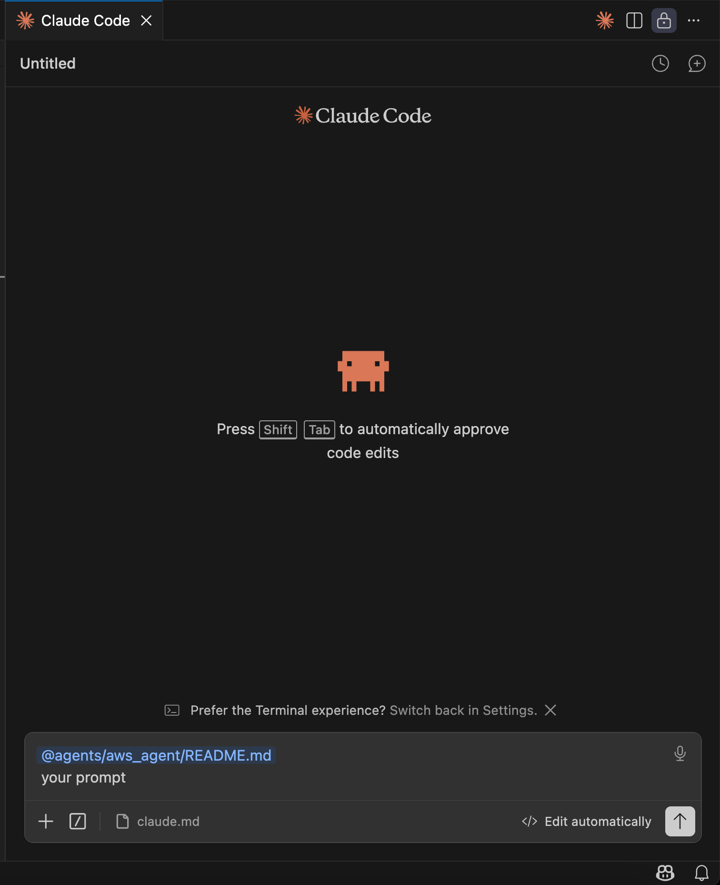

## Claude Code

Claude Code is so popular nowadays. Compared to cline, cursor, it does have its own advantage.
It is backed with Anthropic's various models, and it is specifically designed for coding purpose.

There are some options you can use it, web version, Claude code desktop, or Claude Code extension.

I use the Claude Code extension for VS Code, you can refer to this doc https://code.claude.com/docs/en/vs-code.

It is very easy to use. There are many shortcuts you can use, for example, `@`, `/` etc.

All the Claude's configuration file is sitting in `~/.claude` directory. You can refer to this doc https://code.claude.com/docs/en/claude-directory.
