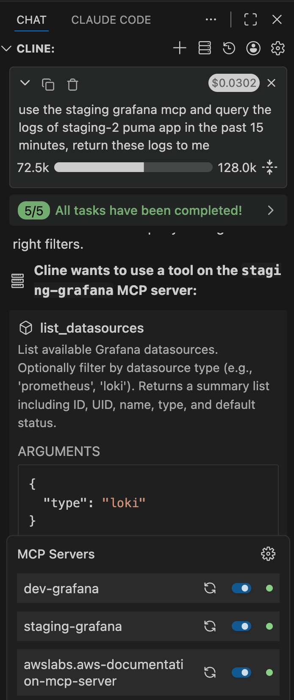

## Using MCP in vscode with cline
Refer to this doc https://docs.cline.bot/mcp/adding-and-configuring-servers for using mcp with Cline.

For example, you can run the Grafana MCP server https://github.com/grafana/mcp-grafana on your local, then using it.

```json
{
  "mcpServers": {
    "devgrafana": {
      "disabled": false,
      "timeout": 60,
      "type": "stdio",
      "command": "docker",
      "args": [
        "run",
        "--rm",
        "-i",
        "-e",
        "GRAFANA_URL",
        "-e",
        "GRAFANA_API_KEY",
        "mcp/grafana",
        "-t",
        "stdio"
      ],
      "env": {
        "GRAFANA_URL": "https://grafana.xxx.yyy",
        "GRAFANA_API_KEY": "glsa_xxxxxxxx"
      }
    }
  }
}
```

After the docker container is started, you can check these MCP servers' status and use them with your prompt. For example, `use the staging grafana mcp and query the logs of dev app in the past 15 minutes, return these logs to me`.



